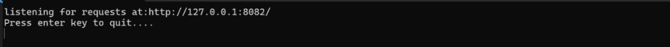
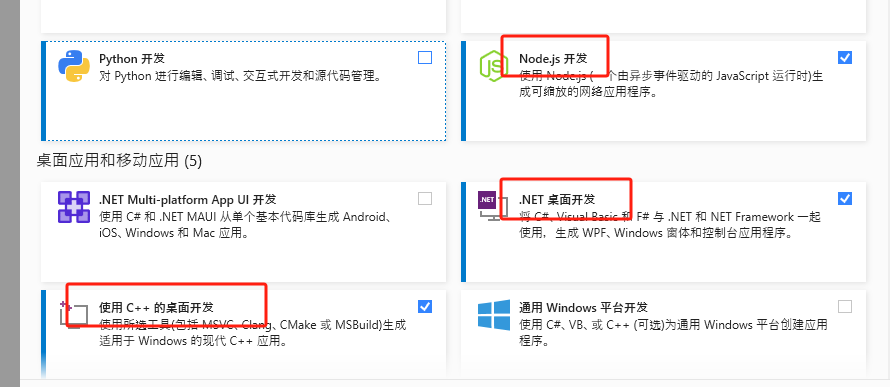
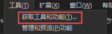
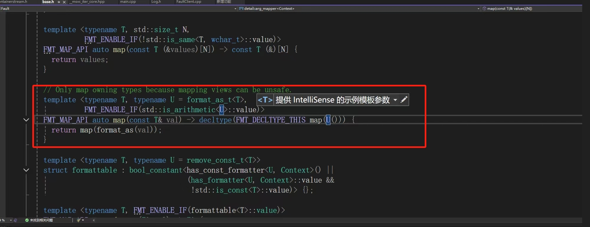
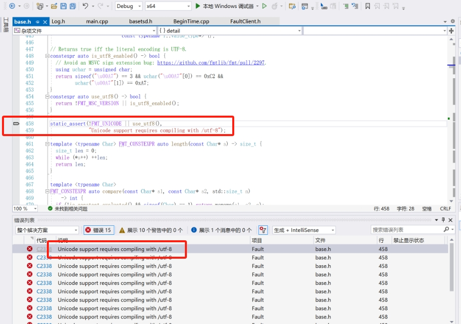
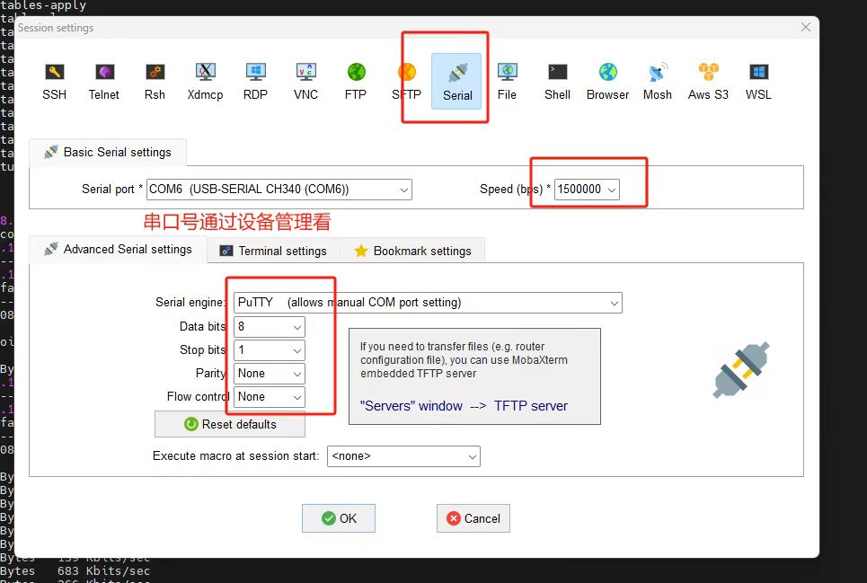
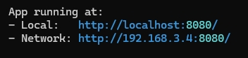
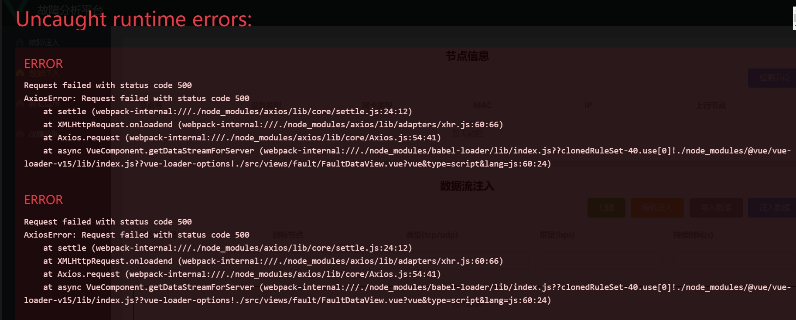

# FaultInjection

FaultInjection是一个控制开发板产生流量数据的简易自研工具，由前端Front和后端Back构成，前端是一个网页界面，用于操作后端。
后端是运行在windows上面的程序， 接受前端命令，转换为ssh命令发送给各个开发板子。所以此程序可以控制开发板的前提是二者网络互通。

## 安装环境

### Back 后端
使用visual studio打开项目**back/Fault.sln**，运行代码，无报错，出现cmd如下窗口即成功。


* visual studio 2022  
    从官网下载安装，需要组件
    

    如果已经安装了vs，可以重新打开此界面  
    

* vcpkg  
    vcpkg作用是c++库管理器，下载管理依赖库
    * 下载vcpkg
        ```
        git clone https://github.com/microsoft/vcpkg.git
        ```
    * 添加vcpkg目录至环境变量
    * 安装，vcpkg目录下
        ```
        .\bootstrap-vcpkg.bat
        ```
    * 整合至vs
        ```
        .\vcpkg integrate install
        ```
    * 安装依赖库
        ```
        .\vcpkg install
        ```
        * libssh 
        * cpprestsdk 
        * jsoncpp
        * boost-filesystem
        * nlohmann-json
        * fmt  
            fmt存在兼容性问题，当报错时注释掉红框内模版
            
    * utf-8兼容性  
        不一定会出现，如果出现了注释掉红框模板
        

### Front 前端
安装npm软件，npm可以直接在cmd中运行验证安装成功。

### 终端工具
控制板子需要终端工具，推荐**MobaXterm**，控制orangepi的板子需要一个额外的usb转串口硬件CH340，串口属性:


## 执行

### 前端

* 在front文件夹中打开命令行 
* 编译命令，只需执行一次
    ```
    npm install
    ```
* 运行命令，编译后可仅执行此命令
    ```
    npm run serve
    ```
    cmd中会生成一个网站，打开即为前端
    
* 前端服务端  
    打开前端网站后会报错
    
    需要额外打开前端的服务端，在front/server文件夹中打开命令行，并且执行
    ```
    node.exe .\MyServer.js
    ```
    然后关掉网页报错
### 后端
使用vs生成并运行解决方案

运行代码，无报错，出现cmd如下窗口即成功。


## 环境设置
### 初始化脚本
一些systemd开机启动脚本用于初始化环境
#### 设置方法
在`/etc/systemd/system`中创建service后缀文件，其中包含需要开机运行sh脚本路径，开机脚本需要`chmod 777`修改权限  
使用`systemctl start service_name`，检查脚本是否可以运行，一般是脚本权限问题，service是service文件去掉后缀的名字
使用`systemctl enable server_name`，设置服务为开机启动
使用`systemctl is-enabled server_name`，检查是否设置为开机启动

#### 已有脚本
* openwifi 启动自动初始化wifi模块
* orangepi adhoc启动自动ping其他板子，用于探测其他板子是否可用

### adhoc初始化配置
自动创建adhoc
```
# 创建连接
nmcli con add type wifi ifname wlan0 con-name my-adhoc ssid MyAdhocNetwork
# 修改为 Ad-hoc 模式
nmcli con modify my-adhoc 802-11-wireless.mode adhoc
# 设置band 2.4GHz
nmcli con modify my-adhoc 802-11-wireless.band bg
# 设置信道目前为6，可以修改
nmcli con modify my-adhoc 802-11-wireless.channel 6
# 配置静态 IP 地址
nmcli con modify my-adhoc ipv4.method manual ipv4.addresses 192.168.13.1/24
# 启用连接
nmcli con up my-adhoc
```

## adhoc路由中转配置
adhoc的无主机形式可以实现超距无线路由中转通讯，假设4块板子
服务器(电脑) --有线-- 1 --adhoc-- 2 --adhoc-- 3 --adhoc-- 4
每个数字相邻的板子在adhoc无线通讯范围内，但是不相邻的板子在adhoc无线通讯范围外。1如果想向3发送信息，必须通过2中转。为实现这种模式，需要设置环境。
### 允许路由中转
`/etc/sysctl.conf`文件中，下面两行的注释取消
```
net.ipv4.ip_forward=1
net.ipv4.conf.all.accept_redirects = 0
```
`ip_forward`运行ip转发；`accept_redirects`拒绝ICMP Redirect，ICMP重定向会建议源地址目标地址直接通讯，但这行不通，无用的尝试会降低网速。

### 设置路由
简单来说，例如1和3无法直接通讯
* 在1上添加路由，往3发送的消息往2发送
* 在3上添加路由，往1发的消息往2发送
* 2上打开ip转发。

四块板子设置路由如下，1号到4号板ip为192.168.13.1-4，192.168.3.0为电脑有线网段
```
# windows电脑
# 192.168.3.24是1号板有线网卡eth0的ip
route ADD 192.168.13.0 MASK 255.255.255.0 192.168.3.24

# 1号板
ip route add 192.168.13.4/32 via 192.168.13.2
ip route add 192.168.13.3/32 via 192.168.13.2

# 2号板
route add -net 192.168.3.0 netmask 255.255.255.0 gw 192.168.13.1
ip route add 192.168.13.4/32 via 192.168.13.3

# 3号板
route add -net 192.168.3.0 netmask 255.255.255.0 gw 192.168.13.2
ip route add 192.168.13.1/32 via 192.168.13.2

# 4号板
route add -net 192.168.3.0 netmask 255.255.255.0 gw 192.168.13.3
ip route add 192.168.13.1/32 via 192.168.13.3
ip route add 192.168.13.2/32 via 192.168.13.3
```

### 创建ap
orangepi自带脚本，创建ap并且共享eth0的网络，创建出来的网卡为ap0，这个命令不知道怎么后台执行，目前是串口执行然后不动它
```
sudo create_ap -m nat wlan0 eth0 orangepi orangepi
```

### 一个桌面板linux作为外网中转
网络拓扑如下
CSU-WIFI --- 桌面板linux --网线-- 服务器板linux --- 自组网wifi

#### dhcp服务器
使用dnsmasq作为dhcp服务器
需要额外设置静态ip
wired connection 1 是connect name
设置
sudo nmcli connection modify "Wired connection 1" \
    ipv4.method manual \
    ipv4.addresses 192.168.4.1/24 \
    ipv4.gateway 192.168.4.1

删除
sudo nmcli connection modify "Wired connection 1" ipv4.addresses "" ipv4.gateway "" ipv4.dns ""

#### 外网
板子可以连接csu-wifi来连接外网
* 板子通过网线连接电脑，电脑共享wifi网络给有线
* wlan0的metric改为50，比eth0的小即可
    sudo nmcli connection modify CSU-WIFI ipv4.route-metric 50
* 板子上运行chromium-browser，可以通过ssh打开chrome浏览器
* 板子上打开的浏览器中，打开认证网页，断开认证
* 断开电脑wifi
* 板子上打开的浏览器中，重新认证
